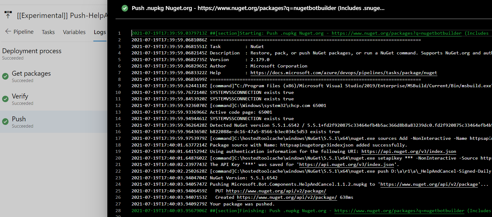

# Components YAML pipelines
Each component in this repository requires a YAML pipeline to define the packaging process that enables publishing on both NuGet and NPM feeds.

## Functional tests
Functional tests are run nightly against the C# and JS variations of both Azure Web App and Functions bots based on the Empty Bot Generator.

### Create shared resources


This pipeline creates Azure resources for all of the test bots to share, in order to save costs and optimize the pipelines. Its should only be run manually when needing to start from scratch.

### Deploy bots


This pipeline installs appropriate dependencies to run a bot generator, pulls the latest preview BotBuilder SDK package, runs the bot generator, creates bot resources (including a Direct Line channel), and publishes to an Azure Bot resource.

### Test bots


This pipeline runs transcript tests against each bot over Direct Line and verifies that the bot has the expected replies. It is triggered only when the deploy bots pipeline is successful.

### Delete shared resources


This pipeline deletes all of the shared Azure resources. It should only be run manually when needing to start from scratch.

## Publishing pipelines

### Getting started
When a component is ready to be packaged for testing, use the following instructions:
1. Duplicate the [starter template](/pipelines/starter-pipeline.yml) in the [pipelines directory](/pipelines) and give it a unique name.
2. Replace `{YOUR_COMPONENT_TYPE}` with the type of package your component is.
  - declarativeAsset (_Only consists of exported dialog, lg, lu, and/or qna files. Packages for nuget and npm feeds._)
  - codeExtension (_Has code for an adapter, custom action, middleware, recognizer, etc. Packages for nuget feeds (at this time)._)
  - generator (_Yeoman generators for bot templates. Packages for npm feeds._)
3. Replace `{YOUR_DEPLOYMENT_RING}` with:
  - preview (_Package is in public preview_)
  - rc (_Package is ready for release candidate_)
  - stable (_Package is ready for release_)

    _This can be overwritten when running a pipeline rather than updating the YAML file later on._
4. Replace the `{YOUR_WORKING_DIRECTORY}` references with the working directory of your component. For example, "/packages/foo".

### Publish a package
The packaging pipeline is responsible for determining the version, building the package, testing it, and signing it, before preparing a release artifact.

#### Preview ring


In this screenshot, the HelpAndCancel package's YAML file is configured for the preview ring. _DeploymentRingOverride_ is left blank and the _ReleaseCandidateNumber_ is ignored. 

The default version produced for the preview ring follows the pattern:
```
{version}-preview.{YYYYMMDD}.{commitHash}
```

For example, this configuration yields:
```
1.1.2-preview.20210819.a2c95b1
```

#### Release candidate ring


In this screenshot, the HelpAndCancel package's YAML file is configured for the preview ring. _DeploymentRingOverride_ is set to "rc" and a _ReleaseCandidateNumber_ is provided. 

The default version produced for the rc ring follows the pattern:
```
{version}-rc{releaseCandidateNumber}
```

For example, this configuration yields:
```
1.1.2-rc1
```

#### Stable ring


In this screenshot, the HelpAndCancel package's YAML file is configured for the preview ring. _DeploymentRingOverride_ is set to "stable" and a _ReleaseCandidateNumber_ is ignored. 

The default version produced for the stable ring follows the pattern:
```
{version}
```

For example, this configuration yields:
```
1.1.2
```

### Release a package
The release pipeline takes the artifact from the publishing pipeline and pushes it onto NuGet or NPM.

#### Get packages

Stage 1 pulls the package artifact and lists the package name.

#### Verify

Stage 2 requires manual intervention from the user to approve or reject the package, after verifying the correct package and version from the first stage.

#### Push

Stage 3 pushes the authenticated package onto the related package management system.

## Navigation
### [Functional tests directory](/functional)
Contains the pipelines to run functional tests: create shared resources, deploy bots, test bots, and delete shared resources.

### [Pipelines directory](/pipelines)
Contains the pipelines that Azure DevOps Pipelines are run against.

### [Templates directory](/templates)
Contains the templates that all pipelines should be built from.
