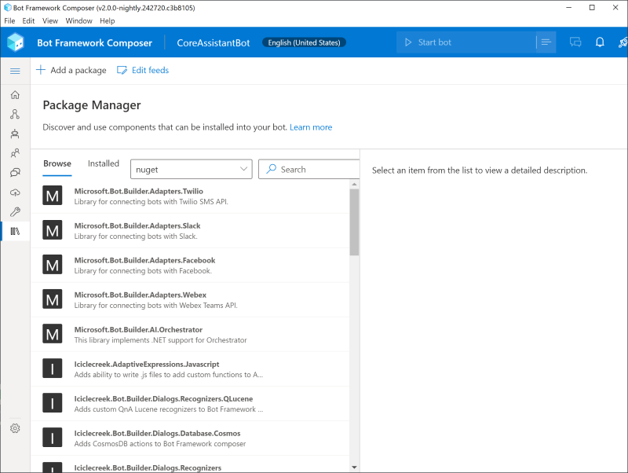

# Extending your bot with packages

Packages are bits of a bot you want to share/import like declarative dialog assets, coded dialogs, custom adapters, middleware or custom actions. They are just regular NuGet or npm packages (depending on the code language for your bot). You'll use the Bot Framework CLI tool to merge the package's declarative contents with your bot (package management in Composer will handle this for you, or you could do it yourself using the Bot Framework CLI tool). They can be made up of any combination of declarative assets (.dialog, .lu, .lg, .qna files), coded extensions (custom actions, middleware, adapters), or just plain old package libraries.

Packages that contain dialog assets **differ from packages you've worked with in the past** slightly. Normally files and libraries contained in a package are not intended to be edited directly, however with declarative assets it is very likely that you will want to alter them to meet your needs. To support this, declarative assets from packages are _merged_ into your bot project, and a copy is created for you to edit. Once you've edited those assets, attempting to upgrade your package will cause a conflict and you'll need to determine manually how to manage merging your edits with the new version of the package.

## Using Bot Framework Composer

> Not seeing the Package Manager? Make sure you've enabled the Component Model feature flag in your Composer settings.

You can open Package Manager with the bottom icon on the left navigation rail.



From there, you can search for, add, update, or remove packages from your bot project. Package manager filters the list of packages to those tagged with `msbot-component` when connected to a public feed, so you will not see all packages your bot project takes a dependency on (you can open your project with an IDE like Visual Studio to see all your package dependencies).

Remember, because declarative assets are merged from a package into your bot project, there may be conflicts. Pay attention if Composer warns you that an action may be destructive.

### Connecting to custom feeds

Package Manager will connect to the primary public package feed based on your bot project's language (for example, C# bots will be connected to NuGet by default). You can however connect to other public feeds, private feeds, or even local feeds to source your packages from. To do so, click on the **Edit Feeds** button and add your feed to the list. When working with local packages, make sure you've created a feed and added your package to it. See the [NuGet documentation](https://docs.microsoft.com/en-us/nuget/hosting-packages/local-feeds) on local feeds for more information.

## Using CLI Tooling

To install packages from the command line, use the normal package installation tool for your bot's programming language:

**With a Node.js runtime:**

Navigate to the runtime folder and run:

```bash
cd runtime
npm install --save [some package]
```

**With a C# runtime:**

Navigate to the runtime folder and run:

```bash
cd runtime/azurewebapp
dotnet add package [some package] --version=[some version]
```

After running one of these commands, the package will be listed in the appropriate place, either the `package.json` or the `.csproj` file of the project. Now, use the Bot Framework CLI tool to extract any included dialog, lu and lg files, as well as to merge any new schema items. Run the following command:

```bash
bf dialog:merge [package.json or .csproj] --imports ../dialogs/imported --output ../schemas/sdk
```

The output of the CLI tool will include a list of the files that were added, deleted or updated. Note that **changes to existing files will be overwritten if newer versions are found in a package.**

## Docs table of contents

1. [Overview](/docs/overview.md)
2. [Extending your bot using packages](/docs/extending-with-packages.md)
3. [Extending your bot with code](/docs/extending-with-code.md)
4. [Creating your own packages](/docs/creating-packages.md)
5. [Creating your own templates](/docs/creating-templates.md)
