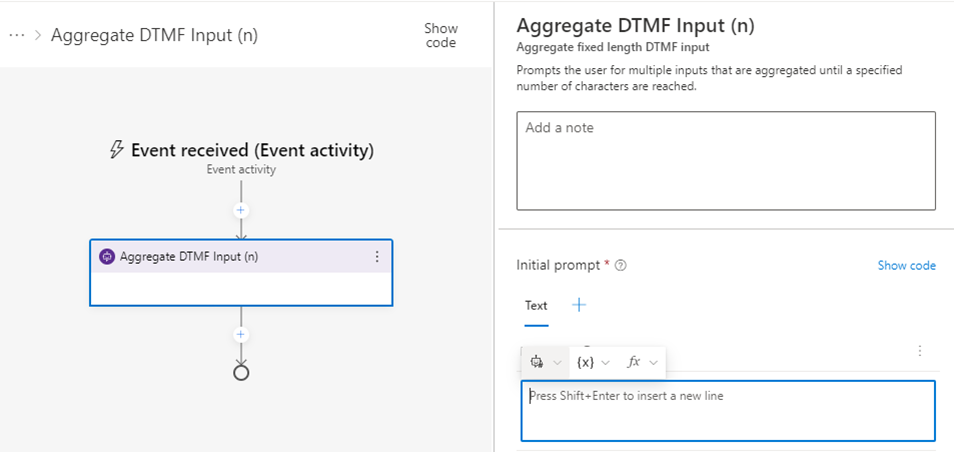
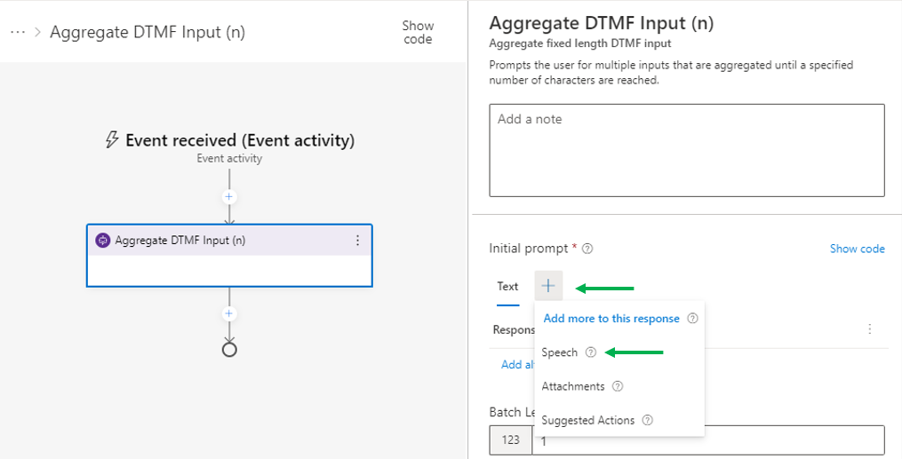
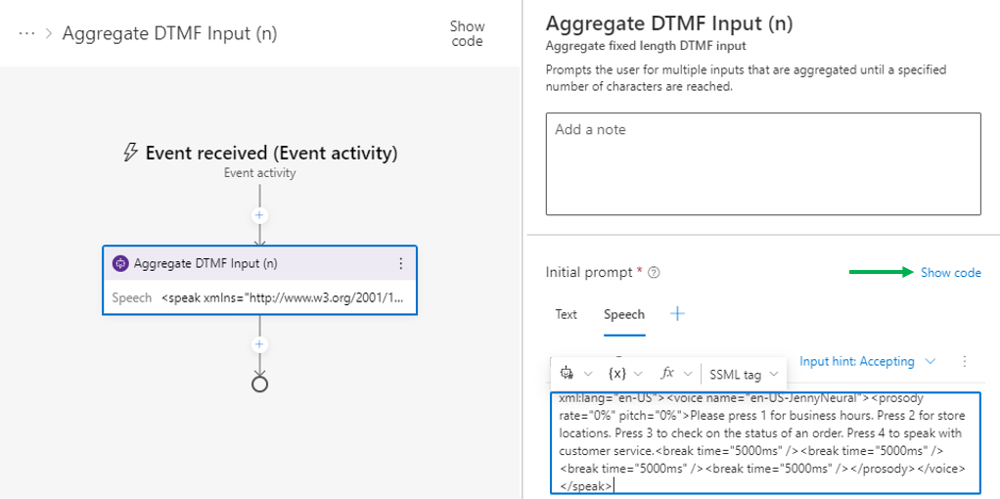
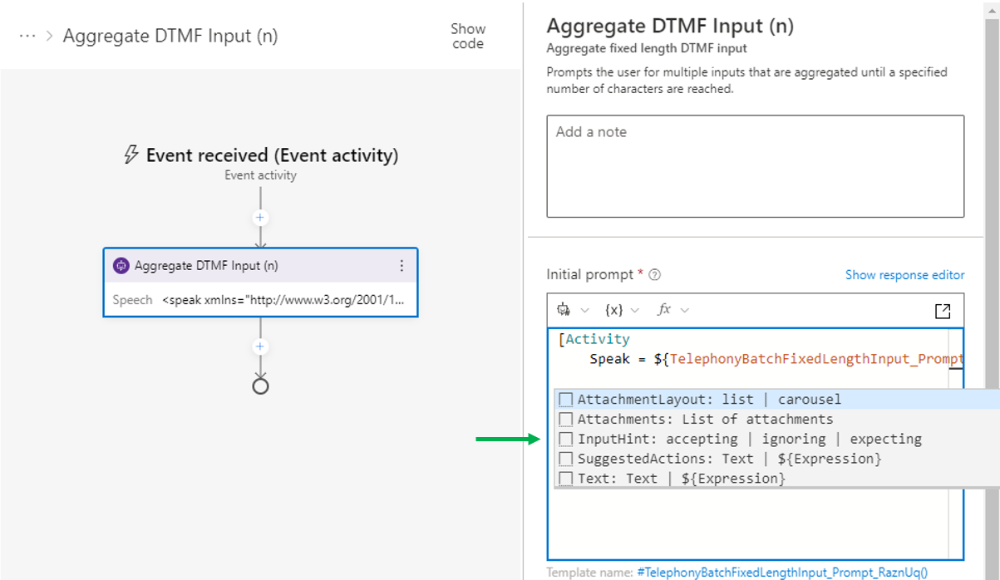
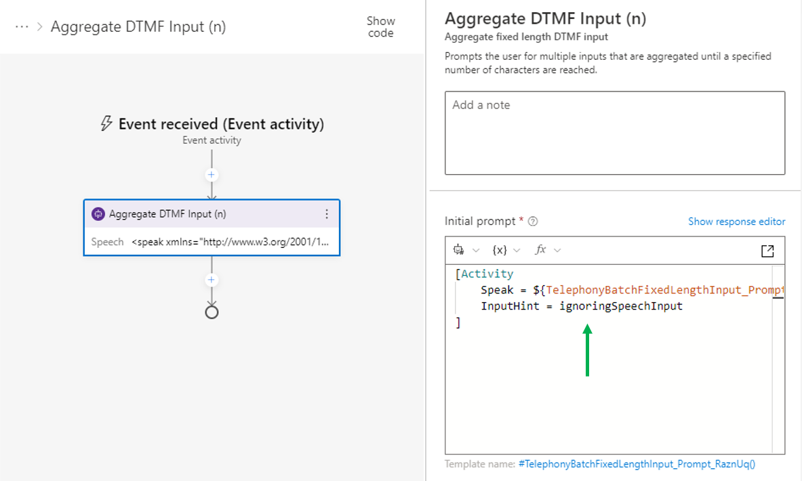
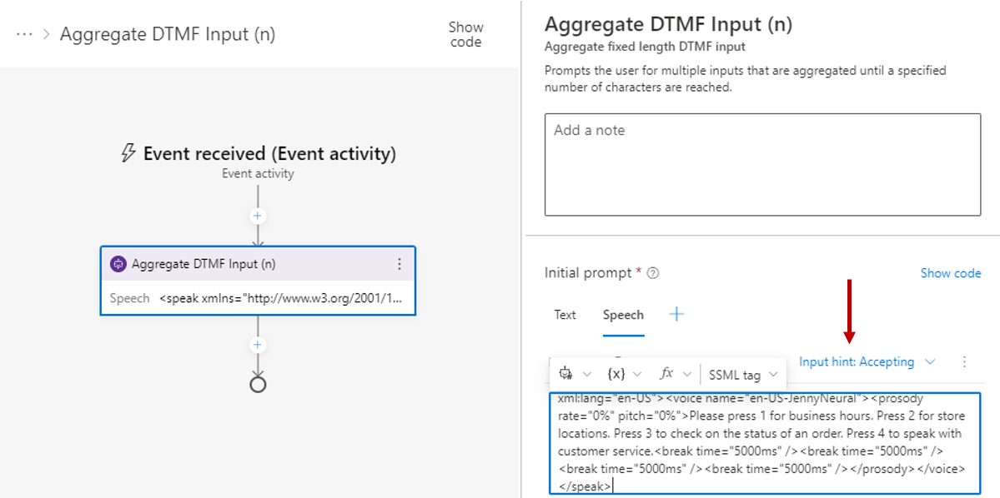
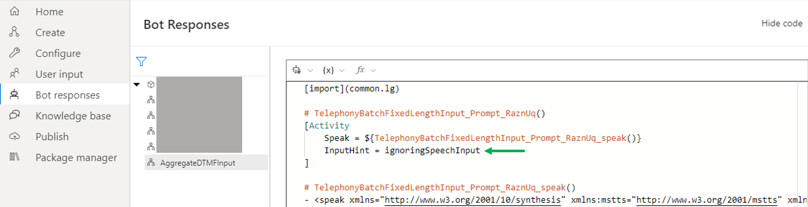
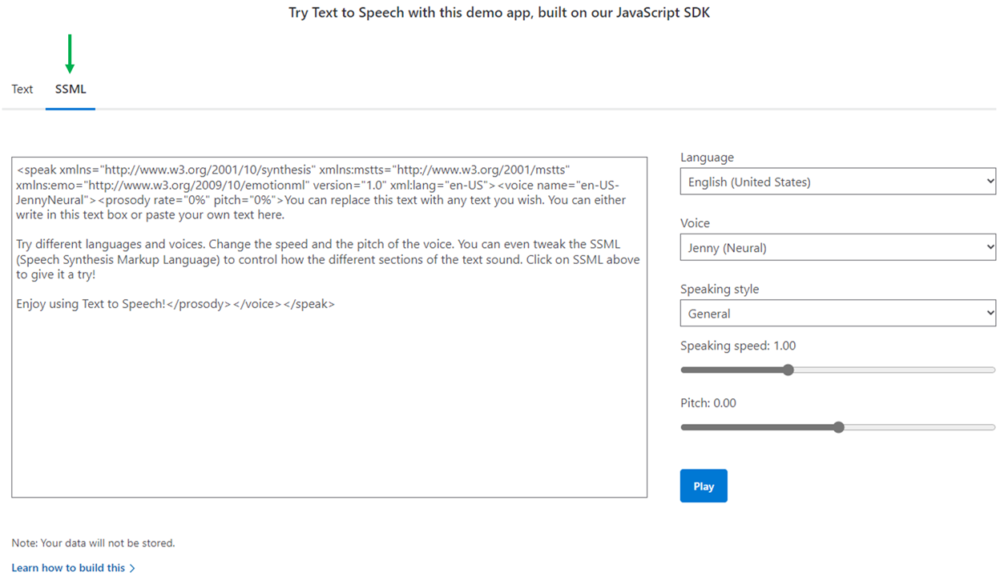

# Telephony FAQ

> Note: For brevity, `Microsoft.Bot.Components.Telephony` will be referred to as _Telephony Extensions_.

## Table of Contents
- [What are `InputHints`?](#what-are-inputhints)
- [How do I configure InputHints in Bot Framework Composer?](#how-do-i-configure-inputhints-in-bot-framework-composer)
- [Why does the response editor show `Input hint: Accepting` instead of my `ignoringSpeechInput` or `ignoringNonSpeechInput` InputHint?](#why-does-the-response-editor-show-input-hint-accepting-instead-of-my-ignoringspeechinput-or-ignoringnonspeechinput-inputhint)
- [How do I configure a bot message to be uninterruptable?](#how-do-i-configure-a-bot-message-to-be-uninterruptable)
- [What are `<break>` tags? Why are `<break>` tags useful?](#what-are-break-tags-why-are-break-tags-useful)
  - [How do I configure my bot to only handle DTMF inputs?](#how-do-i-configure-my-bot-to-only-handle-dtmf-inputs)
  - [How do I configure my bot to only handle speech inputs?](#how-do-i-configure-my-bot-to-only-handle-speech-inputs)
  - [How do I configure my bot to repeat its message after _n_ seconds?](#how-do-i-configure-my-bot-to-repeat-its-message-after-n-seconds)
- [Is there a reference page for Speech Synthesis Markup Language (_SSML_)?](#is-there-a-reference-page-for-speech-synthesis-markup-language-ssml)
- [Can I test my SSML without having to redeploy my bot?](#can-i-test-my-ssml-without-having-to-redeploy-my-bot)


## What are `InputHints`?
The Telephony Channel uses InputHints to determine if it should allow for user barge-in (aka interruptions) while the bot is speaking (message playback).

Interruptions occur when an audio input (speech or DTMF) is detected **while the message playback is ongoing**. Depending on the InputHint being used, the interruption may be processed or ignored.

Within the context of the Telephony Channel (TC), the four primary InputHints are
- `acceptingInput` - Any input will be sent to the bot for processing (**This is the default InputHint**)
- `ignoringInput` - Any input will be ignored
- `ignoringNonSpeechInput` - Any non-speech input will be ignored (i.e., DTMF)
- `ignoringSpeechInput` - Any speech input will be ignored, _only DTMF inputs will be sent to the bot for processing_

As soon as the message playback completes, Telephony will go back to its default state of accepting all forms of input and forward them to your bot.

## How do I configure InputHints in Bot Framework Composer?
Select your message-sending node in [Bot Framework Composer](https://learn.microsoft.com/en-us/composer/introduction?tabs=v2x). As an example, we'll add a Telephony Extensions' `Aggregate DTMF Input (n)` node to our dialog and set the `ignoringSpeechInput` InputHint.

1. Add the `Aggregate DTMF Input (n)` node to a dialog



2. Click on the blue plus button to add Speech responses to the node and add a speech response. After adding a speech response, click on the `Show code` button.




In this example, the following SSML was used:
```xml
<speak xmlns="http://www.w3.org/2001/10/synthesis" xmlns:mstts="http://www.w3.org/2001/mstts" xmlns:emo="http://www.w3.org/2009/10/emotionml" version="1.0" xml:lang="en-US"><voice name="en-US-JennyNeural"><prosody rate="0%" pitch="0%">Please press 1 for business hours. Press 2 for store locations. Press 3 to check on the status of an order. Press 4 to speak with customer service.<break time="5000ms" /><break time="5000ms" /><break time="5000ms" /><break time="5000ms" /></prosody></voice></speak>
```

3. Add a newline to the `[Activity]`, and a pop-up with InputHint and other valid keys will appear. Click `InputHint` in the pop-up, and replace the value after the `=` with `ignoringSpeechInput`.





## Why does the response editor show `Input hint: Accepting` instead of my `ignoringSpeechInput` or `ignoringNonSpeechInput` InputHint?

> _This is a known limitation in Bot Framework Composer (See issue: [microsoft/BotFramework-Composer#9364](https://github.com/microsoft/BotFramework-Composer/issues/9364))_

After exiting the code editor and going back to the response editor, your UI may appear similar to the following screen capture:



Please disregard this and instead inspect the entire response in the code editor, or view all of your bot's responses through the Bot Responses view via the left side menu. 



If you do not see an `InputHint` with your desired InputHint, please add it back to the `[Activity]`.


## How do I configure a bot message to be uninterruptable?
On your bot's message, set the InputHint to be `ignoringInput`. See [_How do I configure InputHints in Bot Framework Composer_](#how-do-i-configure-inputhints-in-bot-framework-composer) above for a walkthrough on setting the InputHint.

## What are `<break>` tags? Why are `<break>` tags useful?
`<break>` tags are used in SSML to add a moment of silence in the message playback. With Telephony, the `<break>` tags' duration can be configured via the `time` property. The max duration is 5000 milliseconds or 5 seconds. More information on the this SSML tag and other SSML tags within the context of Telephony can be found at Speech Service's official documentation: [Speech Synthesis Markup Language (SSML) - Speech service - Azure Cognitive Services | Microsoft Learn](https://learn.microsoft.com/en-us/azure/cognitive-services/speech-service/speech-synthesis-markup).

Besides adding pauses to bots' speech responses for emphasis, `<break>` tags can be used enforce a type user input (e.g., speech or DTMF) by adding them after a prompt and using the desired InputHint. The next three FAQS are examples of how to use the `<break>` tag for a few common scenarios.

- [How do I configure my bot to only handle DTMF inputs?](#how-do-i-configure-my-bot-to-only-handle-dtmf-inputs)
- [How do I configure my bot to only handle non-DTMF inputs?](#how-do-i-configure-my-bot-to-only-handle-non-dtmf-inputs)
- [How do I configure my bot to repeat its message after _n_ seconds?](#how-do-i-configure-my-bot-to-repeat-its-message-after-n-seconds)

## How do I configure my bot to only handle DTMF inputs?
To only handle DTMF inputs, the bot's outgoing activity must be configured in two ways.
1. Set the InputHint to `ignoringSpeechInput`
2. Append multiple `<break/>` tags to your speech response to extend the mesage playback where the `ignoringSpeechInput` InputHint is still applicable

> See [_How do I configure InputHints in Bot Framework Composer_](#how-do-i-configure-inputhints-in-bot-framework-composer) above for a walkthrough on setting the InputHint.


**Example scenario:**<br/>
The bot provides four DTMF options for users to select. After the bot finishes speaking, an additional 20 seconds is added to the message playback, during which only DTMF inputs are accepted.

**Example SSML:**<br/>
```xml
<speak xmlns="http://www.w3.org/2001/10/synthesis" xmlns:mstts="http://www.w3.org/2001/mstts" xmlns:emo="http://www.w3.org/2009/10/emotionml" version="1.0" xml:lang="en-US"><voice name="en-US-JennyNeural"><prosody rate="0%" pitch="0%">Please press 1 for business hours. Press 2 for store locations. Press 3 to check on the status of an order. Press 4 to speak with customer service.<break time="5000ms" /><break time="5000ms" /><break time="5000ms" /><break time="5000ms" /></prosody></voice></speak>
```

## How do I configure my bot to only handle speech inputs?
To only handle speech inputs, the bot's outgoing activity must be configured in two ways.
1. Set the InputHint to `ignoringNonSpeechInput`
2. Append multiple `<break/>` tags to your speech response to extend the mesage playback where the `ignoringNonSpeechInput` InputHint is still applicable

> See [_How do I configure InputHints in Bot Framework Composer_](#how-do-i-configure-inputhints-in-bot-framework-composer) above for a walkthrough on setting the InputHint.


**Example scenario:**<br/>
The bot provides four options for users to select via saying the corresponding number. After the bot finishes speaking, an additional 20 seconds is added to the message playback, during which only speech inputs are accepted.

**Example SSML:**<br/>
```xml
<speak xmlns="http://www.w3.org/2001/10/synthesis" xmlns:mstts="http://www.w3.org/2001/mstts" xmlns:emo="http://www.w3.org/2009/10/emotionml" version="1.0" xml:lang="en-US"><voice name="en-US-JennyNeural"><prosody rate="0%" pitch="0%">Please say 1 for business hours. Say 2 for store locations. Say 3 to check on the status of an order. Say 4 to speak with customer service.<break time="5000ms" /><break time="5000ms" /><break time="5000ms" /><break time="5000ms" /></prosody></voice></speak>
```

## How do I configure my bot to repeat its message after _n_ seconds?
If a user is unable to reply within _n_ seconds, you can have the bot repeat its message after any `<break>` tags.

**Example scenario:**<br/>
The bot provides four DTMF options for users to select. After 20 seconds, the bot should say, _"I'm sorry, I didn't get that,"_ and repeat the original options with an additional 10 seconds of `<break>` time.

**Example SSML:**<br/>
```xml
<speak xmlns="http://www.w3.org/2001/10/synthesis" xmlns:mstts="http://www.w3.org/2001/mstts" xmlns:emo="http://www.w3.org/2009/10/emotionml" version="1.0" xml:lang="en-US"><voice name="en-US-JennyNeural"><prosody rate="0%" pitch="0%">Please press 1 for business hours. Press 2 for store locations. Press 3 to check on the status of an order. Press 4 to speak with customer service.<break time="5000ms" /><break time="5000ms" /><break time="5000ms" /><break time="5000ms" />I'm sorry, I didn't get that. Please press 1 for business hours. Press 2 for store locations. Press 3 to check on the status of an order. Press 4 to speak with customer service.<break time="5000ms" /><break time="5000ms" /></prosody></voice></speak>
```

## Is there a reference page for Speech Synthesis Markup Language (_SSML_)?
Yes! It can be found at [Speech Synthesis Markup Language (SSML) - Speech service - Azure Cognitive Services | Microsoft Learn](https://learn.microsoft.com/en-us/azure/cognitive-services/speech-service/speech-synthesis-markup).

The topics covered include but are not limited to:
- Having your bot play an audio file
- Configuring the `<break>` tag for pauses
- Adjusting prosody and emphasis
- Using phonemes to improve pronunciation

## Can I test my SSML without having to redeploy my bot?
You can test your SSML at the [Text to Speech - Realistic AI Voice Generator | Microsoft Azure](https://azure.microsoft.com/en-us/products/cognitive-services/text-to-speech/#features) page.

When you see the demo app, make sure to select the **SSML** option, indicated by the green arrow in the screen capture below.

