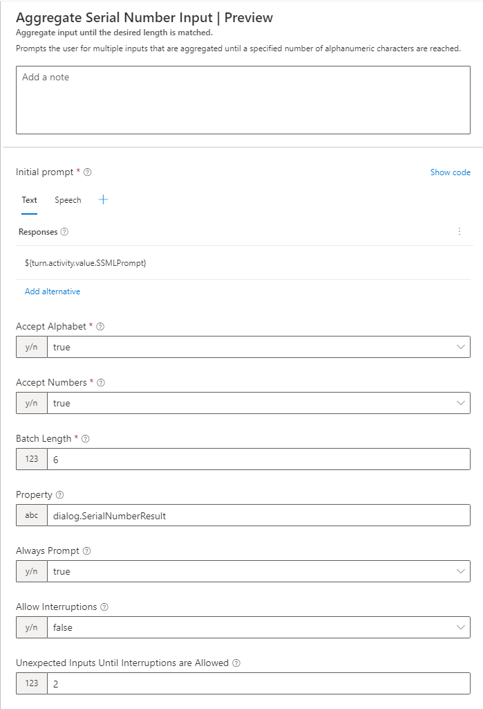

# Aggregating alphanumeric inputs with SerialNumberInput (PREVIEW)

> Note: For brevity, `Microsoft.Bot.Components.Telephony` will be referred to as _Telephony Extensions_.

## Table of Contents
- [Disclaimer](#disclaimer)
- [Usage](#usage)
- [Configuration](#configuration)
- [Limitations](#limitations)

## Disclaimer
The `SerialNumberInput` action is currently released in "_Preview_" status. _Preview_ means that this area of the product is actively undergoing development and is not considered to be "Generally Available" (GA). 

Until `SerialNumberInput` is released as GA, breaking changes may occur between version releases (e.g., the configuration or functionality may change in a way that drastically alters the End-to-End (E2E) behavior).

Since breaking changes may occur, it is recommended to **not** use `SerialNumberInput` action in production environments without heavy testing. Users of the `SerialNumberInput` action should be cautious, check the [Readme.md](./Readme.md) for a changelog and complete full E2E test passes when picking up a new version of `Microsoft.Bot.Components.Telephony`.

## Usage
The `SerialNumberInput` action is used to capture alphanumeric inputs from a user, e.g., a serial number or a model number. The bot will aggregate user inputs until the expected batch length is reached.

### Example scenario:
A Telephony-enabled bot is using the Telephony Extensions to prompt users for the model number of the product. The bot is using the `SerialNumberInput` action to aggregate multiple user inputs into a single value. 

When the bot asks users for the product number, that part of the conversation might sound like the following:

> **Note: Assume that for every new line with "Bot:" or "User:", this line is a new message sent through Telephony** 
> Bot: You selected "get warranty information for product."
*\<brief pause\>* Please provide the model number for the product to hear about its warranty. A valid model number will contain seven alphanumeric characters, such as _"R420042"_. 
User: C 
User: 6 
User: 6 
User: T 
User: 6 
User: 7 
User: 6 
Bot: You provided the model number "C66T676" for the Contoso model. The warranty is...

## Configuration

### Parameters
- Prompt (**required**)
- Accept Alphabet (**required**, defaults to `true`)
- Accept Numbers (**required**, defaults to `true`)
- Batch Length (**required**)
- Unexpected Inputs Until Interruptions are Allowed (defaults to `2`)
- AllowInterruptions (defaults to `false`)
- AlwaysPrompt

### "Unexpected Inputs Until Interruptions are Allowed" parameter
The `Unexpected Inputs Until Interruptions are Allowed` parameter indicates how many unexpected inputs are allowed until all inputs are treated as potential interruptions. Its intended use is to permit users to gracefully exit out of the `SerialNumberInput` dialog flow and prevent users from entering a stuck state where the bot waits for a successful aggregation without informing the user of the current aggregation status _when `AllowInterruptions` is `false`_. The `Unexpected Inputs Until Interruptions are Allowed` parameter is **unused** when `AllowInterruptions` is `true`.

**Note: When `AllowInterruptions` is `false` bots should use `Unexpected Inputs Until Interruptions are Allowed`. It is highly recommended to use the default value of `2` or to use an integer less than `5` for a better end-user experience.**

The `SerialNumberInput` action's behavior of when `Unexpected Inputs Until Interruptions are Allowed` is `2` and the `Batch Length` is `5` can be found below:

> **Note: Assume that for every new line with "Bot:" or "User:", this line is a new message sent through Telephony** 
> Bot: Enter your serial number number.
User: A 
User: B 
User: C 
User: 1 
User: cancel 
User: cancel `// After the second unexpected input, any user inputs that don't contribute to a succesful input aggregation are treated as potential interruptions` 
User: cancel 
Bot: Cancelling all dialogs.

### Example of Authoring Experience in Composer

#### Dialog Flow
- The dialog will only end and continue to the next dialog when the batch length is reached.

## Limitations
- `SerialNumberInput` does not support the conversion of DTMF inputs to letters, DTMF tones are processed as `"123456789#*"`.
  - E.g., a user pressing `2` in rapid succession will not be aggregated by the `SerialNumberInput` action as an `A`, it will be aggregated as `22`.
- `SerialNumberInput` does not support the handling of dashes (e.g., `"-"` in `"C66-T676"`).
  - Tracking in Feature Request: https://github.com/microsoft/botframework-components/issues/1451
- `SerialNumberInput` does not support custom substitution tables for disambiguating user inputs, supporting multiple languages, custom keywords
  - Tracking in Feature Request: https://github.com/microsoft/botframework-components/issues/1450