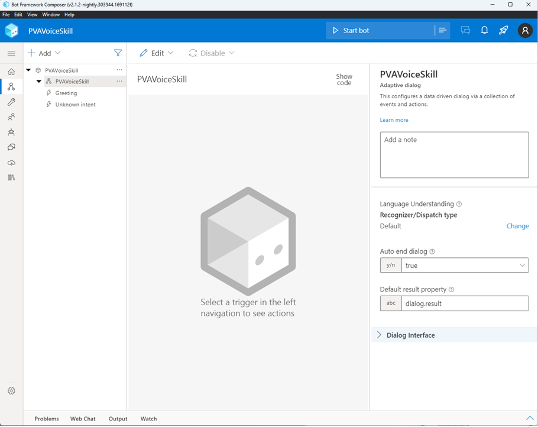
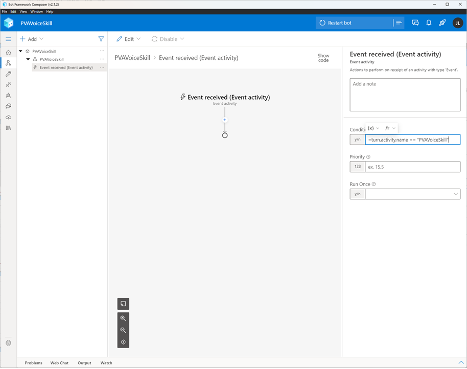
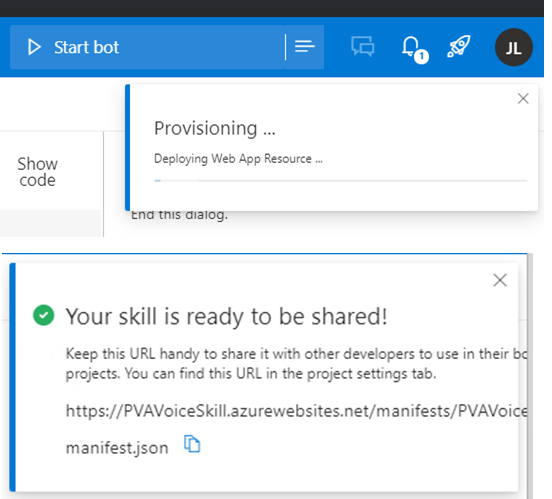
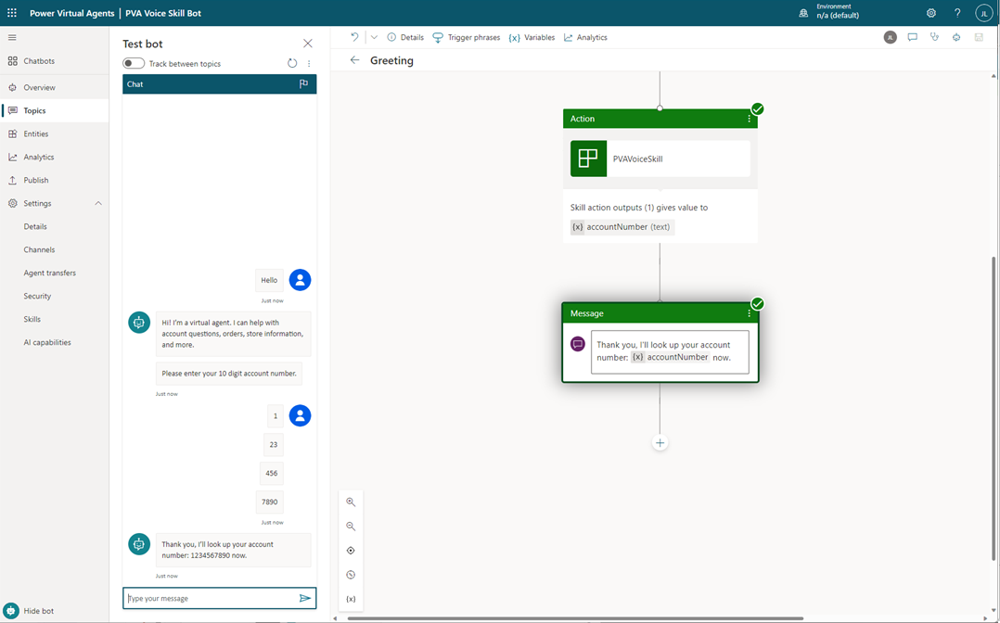

# Using Bot Framework Composer skills to extend Power Virtual Agents Telephony Capabilities

> Note: For brevity, `Microsoft.Bot.Components.Telephony` will be referred to as _Telephony Extensions_.

## Table of Contents
- [Overview](#overview-of-telephony-skills-in-PVA)
- [What is a Bot Framework Skill and how does PVA use them?](#introducing-skills)
- [Basics of implementing a skill for Telephony in Bot Framework Composer](#basic-telephony-skills-guide)

## Overview
Dynamics Customer Service Voice offers a full customer service solution complete with integrated IVR capabilities, provided by Power Virtual Agents. This integration enables AI automated call deflection authored by the customer in a low-code fashion. The initial release of Power Virtual Agents in OC implements basic IVR functionality with a roadmap of extensive improvements incoming.

Customer getting started today still need sophisticated capabilities which aren't all yet offered in the native PVA authoring environment. To that end, customers can use the PVA extensibility features such as integration of Azure hosted Bot Framework Skills to enable more sophisticated voice capabilities until they are available natively in the PVA product.

Currenty, voice features not supported natively in PVA that can be implemented through Bot Framework Skills:
- `DTMF Aggregation` - Prompt that collects a string of digits using the end user's touch tone keypad
- `Barge-In Controls` - Inline configuration behavior of specific prompts for when the customer can and cannot interrupt processing
- `Uninterruptible Messages` - Ability to send uninterruptible messages (also available in composer in PVA without skills)
- `Alphanumeric String Input` - Prompt that collects strings of characters and digits, spoken verbally (**coming soon**)
- `Prompt Timeouts` - Ability to time out waiting for user to respond to a prompt and continue processing (**coming soon**)

## What is a Bot Framework Skill and how does PVA use them?
Put simply, a skill is another Chatbot implemented using the Bot Framework and deployed to Azure or other preferred environment. Skills are a general concept of the Bot Framework, documented in this [Skills Overview](https://learn.microsoft.com/en-us/azure/bot-service/skills-conceptual?view=azure-bot-service-4.0). Pro-coders in the Bot Framework ecosystem often use skills to partition logic across multiple bots, and then integrate them with a "central" bot via the skills capability. They can be coded in a variety of languages (C#, Java, etc), or can be developed using the Bot Framework Composer [About Skills in Composer](https://learn.microsoft.com/en-us/composer/concept-skills).

In the context of Power Virtual Agents and Dynamics Customer Service Voice, the intent is not to use skills for an extensive portion of the bot authoring experience, but rather for specific voice-related tasks not natively supported in PVA today. For example the bot may have several steps completed in PVA, and then need to ask the customer to enter their account number, then continue the flow. Only the prompt for the account number would be moved to the Bot Framework skill.

In Power Virtual Agents, use of an existing skill is straightforward. There's built-in capability to configure PVA to call the skill, and then it becomes another node on the authoring canvas. Learn more about [Configuring a skill for use in Power Virtual Agents](https://learn.microsoft.com/en-us/power-virtual-agents/configuration-add-skills).

## Basics of implementing a skill for Telephony in Bot Framework Composer
To create a bot framework skill, you'll need a set of things to be successful:

- An [Azure Account](https://azure.microsoft.com/free/)
- The [Bot Framework Composer](https://aka.ms/bf-composer-download-win) (optional, but assumed for this document)
- A PVA Bot integrated with Dynamics Customer Service Voice

Assuming you have the items listed in the requirements above, our basic flow will be to create a project with Bot Framework Composer; author a basic skill; configure the skill and PVA to trust each other; and then publish the skill to Azure. There are a number of steps, but none is particularly complicated.

### Setting up the environment
First up, given you've installed Composer, open it up. Create a new bot and you'll be asked to choose from a template.  For our purposes we just need an Empty Bot. Choose the template, hit next, and give it a name and a storage location. For now, choose Azure Web App as the skill'sr Runtime type.


After this, you'll be taken to the composer authoring canvas, which you'll find is relatively similar to that in Power Virtual Agents. Composer has a lot of core functionality, and is also extensible.  In this case, we'll be extending Composer with a the Telephony Package. From the left nav of the Composer UI, choose **Package Manager**, and from within that UI search for Telephony. Select the only package that's returned, and add it.




### Creating the top level dialog and event trigger
Authoring a skill is very similar to authoring Topics in PVA. This skill will be called from PVA directly via an Event, so we won't need to define any natural language trigger types. We will however, create an **Activity trigger** of type **Event Received**; which is what PVA will send when it wants to invoke this skill.

In the left panel under the word "Add", choose the item in the second level of the hierarchy, representing the dialog. Under the **...** menu, choose **Create a Trigger**, and in the subsequent popup, choose the Trigger type **Activities**, and the Activity Type **Event Received (Event Activity)**. Hit submit and a new Event Activity trigger will be created.  


The Event Activity Trigger you've created will be where the part of the dialog not currently supported in PVA will be implemented. In this scenario, we'll add a DTMF Aggregation flow, which would be used to let a user type in a 10 digit phone number for example.

To get started, first we're going to define a trigger for the event that looks for a particular activity name of **PVAVoiceSkill** to be passed from PVA to the Bot. First, click on the new Event you've created, and the right panel, look for the **Condition** field. This will need to be a specific value:

```code
=turn.activity.name == "PVAVoiceSkill"
```



That complete - the setup for our new topic is done.

### Authoring a skill
As mentioned previously, the **Telephony Package** that was added earlier is now available as extended capabilities of the authoring canvas. Clicking the "+"/add a node UI element in the authoring canvas brings up the node types including a new Telephony and Silence Detection section.


Choose the Telephony submenu of the add a node UI and then choose **Aggregate DTMF Input (n)**.  This node is used to request the user enter a string of digits with their keypad of a specific length. Once they've typed enough digits, the condition will be met and the dialog will capture that into an output variable and proceed with the dialog. The other option, **Aggregate DTMF Input (#)** waits for a specific character to be hit before proceeding.

To configure the prompt, we'll first choose to add the speech modality to the node. On the right hand panel under *Initial Prompt*, choose the *+* button, and choose the *Speech* type. Under *Responses*, you can specify a prompt for the user. You should also specify the number of digits required for the user to complete reques, and finally the state variable to put the collected value in. Composer variables are dynamically created, so you can specify dialog.*variableName*.

To make that prompt non-interruptible while the bot is speaking, under *Input Hint* choose **Ignoring**. While the Bot is speaking, the bot will ignore all interruptions. More on the inputHint and what it can do can be found in the references at the bottom of this document.


Now that the bot has captured the DTMF digits, they need to be returned back to Power Virtual Agents. Add a new node, and from the **Dialog management** submenu, choose **End this dialog**. The **End this dialog** action will of course signify the end of the dialog. The value field will be used to set the output variable from the dialog to the skill interface as well as returning it to the to the parent dialog.  


In the **Value** field of the properties pane, use the syntax below (substituting the property the result of the **Aggregate DTMF Input (n) action** for the right side of the colon). The name on the left of the colon is the variable name you want to appear in PVA and will be needed in subsequent steps.

```code
 ={accountNumber:dialog.accountNumber}
```


With the Event now completed, click again on the PVAVoiceSkill parent dialog.  In the bottom right is the dialog interface, used to populate the manifest that PVA will use to understand what capabilities the skill offers, and what values will be passed in and out. In the **output** section, the **Key** is the same as the string from the left side of the colon in the previous steps. The other values can be specified as appropriate to the type of value and description of the field.


<br><br>

## Configuring the bot as a skill
In this section, you'll need access to the PVA Authoring canvas (or a copy of the **Bot ID** from the General/Advanced menu in PVA ). The Bot ID will be used to ensure that the skill only responds to requests from PVA through service-to-service authentication methods similar to how Bots created with the Bot Framework interact with the Azure Bot Service.

Publishing a skill to Azure first requires defining what parts of the bot are to be exposed as a skill and metadata about the skill. Start by choosing the **...** menu option from the top of the hierarchy in the authoring canvas representing the name of the bot, and choose **Export as skill**.  The term export is used loosely, mostly this is the same as publishing except the manifest and other skill related artifacts are created.

<br/>
> Note: Once the skill has been exported and is working, updates to the logic of the skill (without changing the interface in a way that changes the manifest) can be published through the standard publish UI. If the interface has to be changed in some way, please re-use the **Export as Skill** UX, and re-import the skill into PVA.

<br/>


The first page includes metadata. This informatio will be visible in PVA when the skill is consumed, but otherwise is not actionable. 


The second page includes the dialogs to be shared. For this sample only one is being exposed, but it would be possible that multiple dialogs will be exposed for various needs in the PVA bot. A single dialog to, for example, capture an account number might be used in multiple places in the Bot as well without needing a new skill for each.


The next page exposes any other non-Event triggers that could be exposed. Leave anything here unselected (for now) and move to the next page.


As mentioned earlier, here is where the PVA **Bot ID** is needed to help secure the conversation between bot and skill. Return to PVA and under **Skills**, choose **Add skill**. The add skill page will have a copyable link to the **BotID**.  Copy that and return to the Composer.


Back in Composer we need to add the PVA **Bot ID** to the list of **Allowed Callers** - so the skill will only allow the specific PVA Bot in question to invoke it. In the left panel of Composer, open the **Configure** menu (wrench icon) and choose **Skill Configuration**. From here add the **Bot ID** to the **Allowed Callers** section.


## Publishing to Azure including creating Azure resources
The first time publishing a Bot to Azure can be a daunting task, however, Composer takes care of much of the legwork. Once configured, re-publishing the skill subsequently is just a couple of clicks.

The process of setting up publishing to Azure involves creating a reusable object called a *publishing profile*. In the first step give the Publishing Profile a name and choose Publish bot to Azure.


On the next page, for this tutorial we'll choose **Create new resources**. Composer does support importing existing ones created by an administrator, however that's out of scope for this document.


The next page is really about organizational structure. The **Subscription** is sort of a billable unit of organization in Azure, while the **Resource group** is more of a project level container.  For this tutorial choose **Windows** as the OS.

**Resource details** get to the specifics of what the Auzre resources should be called, and where they should be located geographically. PVA has no expections about where the skill is deployed geographically, while your organization may have specific needs for where this is located for data handling purposes.


On the **Add Resources** page, we'll choose which resources will be used in the skill.  The *(AAD) App Registration*, *App Services* and *Microsoft Bot Channels Registration* are mandatory. If the skill must be durable against outages and reboots, *CosmosDB* will be an effective tool to share conversation state between multiple instances of the skill. It is not strictly needed. For this tutorial, all the other resources are unnecessary.


That's basically it, hit **Generate and Publish** and the publish profile created will be used to create the appropriate organization structures on Azure, create the resources specified, and publish the skill code and manifest. 


The final publish notification includes the link to the manifest that will be needed later. It can also be retrieved from the publish page on the right side of the row for the published Skill.



Once the skill is published, a last step before leaving Azure. To further ensure security, PVA requires that a skill be in the same *AAD Tenant* as the PVA Bot. First go to the Azure Portal in the browser at (https://portal.azure.com). Log in, and navigate to the App Registration section.


Within here, search for the app registration using the name for the skill. Once found, click on the **Branding and Properties** element in the left hand menu. From here, either the **Home Page URL** must match the domain of the skill or the **Publisher Domain** must match the AAD tenant of the PVA Bot. The latter is the more secure solution.


That's the last step in Azure. Close the portal and return to PVA. In the **Skills** menu on the left nav, choose **Add skill**, and return to the page we viewed to collect the Bot ID. Paste in the manifest URL and hit the validate button. If successful, hitting save will finish the operation and the skill will be added to PVA.

> NOTE: If validation fails, there's likely something that needs adjusted in the dialog interface or alternately with the matchup between the AAD tenant of the bot and the skill.


Clicking on the skill once ingested displays a details page with information about the manifest along with data that indicates it did or did not discover the input/output parameters specified earlier.


## Using the skill in PVA
Now for the last steps. The Bot Framework skill has been created and deployed, the skill & AAD registration are properly configured to ensure no security issues, and the PVA bot is now aware of the skill you've created. To call the skill from the PVA bot, add the skill which now appears at the bottom of the the **Call an Action** authoring canvas context menu.


Note that the return value defined in the skills' dialog interface section should show up as an output of the skill. It's possible also to return other simple types from the skill, or pass them to the skill. In this case the variable can be referred to in the authoring canvas as any other dialog property would be.


And now on to testing. Save the changes, then try interacting with the bot on the test canvas. If all has gone well, the skill should be executed as a step just like any other dialog step in the bot.



## Now that that works, what's next?
The Bot Framework Skills offer a collection of Telephony capabilities that can be utilized as well as more granular control over voice interactions. See the related sections in the links below to learn how to use the skill you've created to implement more advanced features in the PVA IVR.
