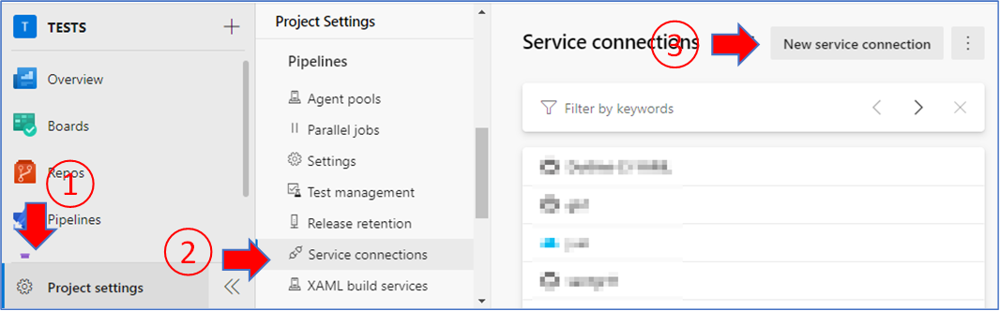
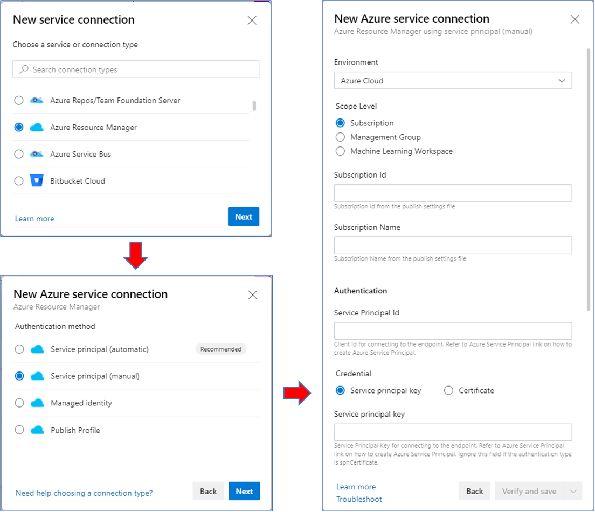

# How to add a Service Connection to an Azure Resource Manager

The following steps will guide you on how to add a Service Connection to an Azure Resource Manager in your DevOps organization. This is a required step to connect your Azure Subscription to the pipelines and deploy resources to Azure.

**Note: The name you use for the resource will be used as `AzureSubscription` in the pipeline's variables.**

Go to [Service connections](https://docs.microsoft.com/en-us/azure/devops/pipelines/library/service-endpoints?view=azure-devops&tabs=yaml) for more information.

## Requirements

- An [Azure DevOps Organization](https://docs.microsoft.com/en-us/azure/devops/organizations/accounts/create-organization?view=azure-devops).
- Access to an active [Azure Resource Manager](https://docs.microsoft.com/en-us/azure/azure-resource-manager/management/overview).

## Steps

- From your Azure DevOps project, go to `Project settings -> Service Connections -> New Service connection`.

  

- Select `Azure Resource Manager -> Service principal (manual)` and fill out the form. Check the `Grant access permission to all pipelines` option. The name you use for the Subscription Name field will be your `AzureSubscription` variable in the pipelines.

  

- Click on `Verify and save` when done.
