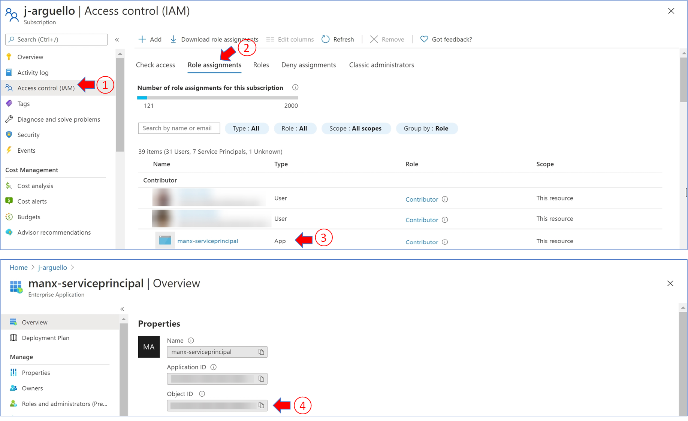

# Hot to get the Service Principal's Object ID

The following steps will guide you on how to get the Service Principal's Object ID.

## Requirements

- Access to a [Service Principal](https://docs.microsoft.com/en-us/azure/active-directory/develop/app-objects-and-service-principals).

## Steps

- Go to `Azure subscription -> Access control -> Role assignments` and select the service principal used to configure the service connection.
- Copy the value of the `Object ID`.

  
