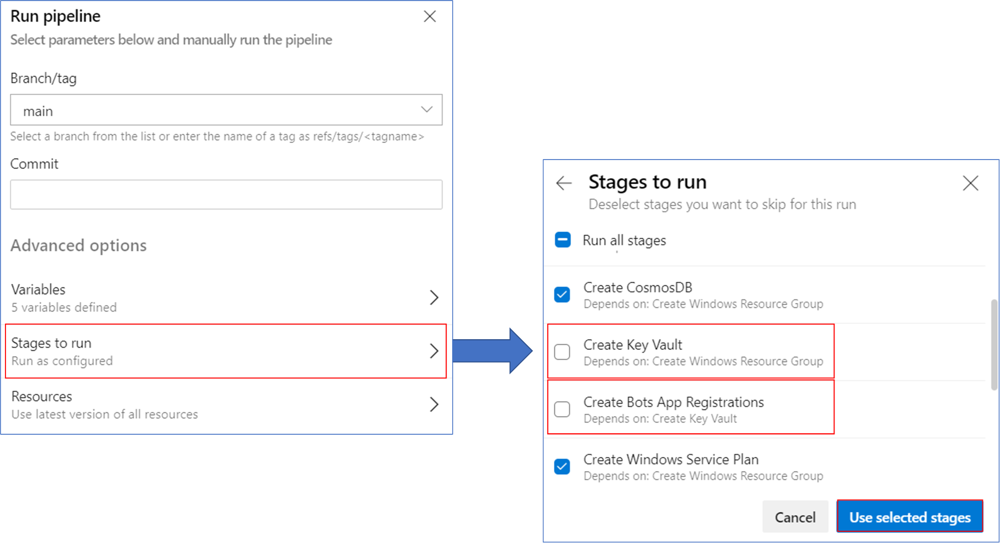
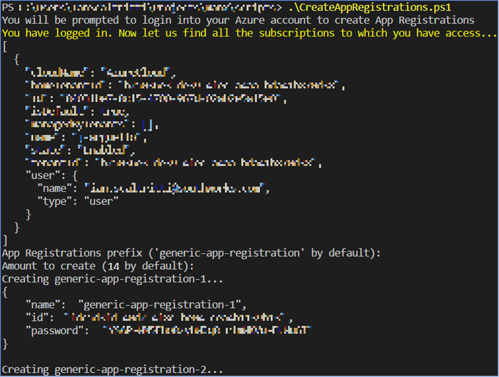
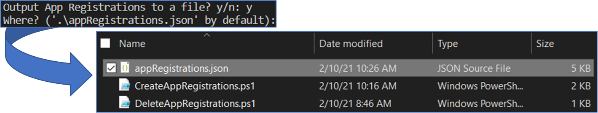
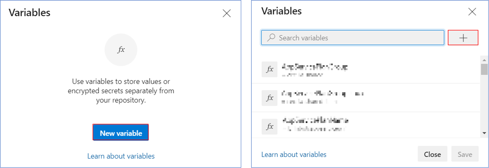
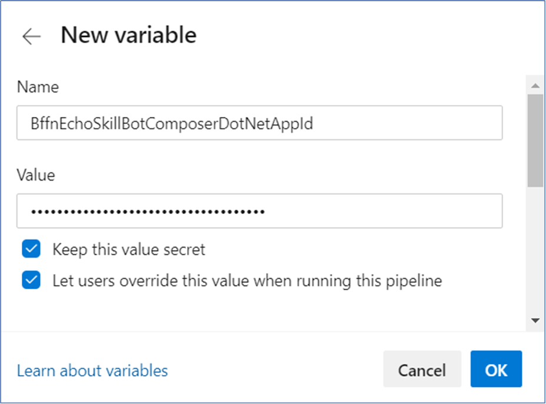

# How to setup up App Registrations

The following steps will guide you on how to manually set up App Registrations.
By default, App Registrations are created and used automatically across the [pipelines](./pipelines.md), but the possibility of setting them up manually is available.

## Requirements

- An active [Azure Subscription](https://azure.microsoft.com/en-us/free/).

## (optional) Skip the automatic creation/deletion of App Registrations at runtime

The Key Vault and App Registration creation/deletion stages can be skipped at runtime on the [Create Shared Resources](../build/yaml/sharedResources/createSharedResources.yml) and [Cleanup Resources](../build/yaml/cleanupResources/cleanupResources.yml). Running these stages without having assigned the required Service Principal permissions can lead to errors (although these errors won't interrupt the rest of the processes, so this step is optional).
To skip stages, simple click on Stages to run, deselect them, and click Use selected stages before running the pipeline (see picture below).

## Create App Registrations

App Registration credentials must be created for each bot to be deployed and tested (there are fourteen currently, but the number is expected to increase in the future).
To do this, you could head to [App Registrations](https://portal.azure.com/#blade/Microsoft_AAD_RegisteredApps/ApplicationsListBlade) on Azure and create them one by one, but we created a PowerShell script to create registration batches automatically. The only requirement to run it is to have access to an active Azure account.

Click [here](./media/CreateAppRegistrations.ps1) to go to the script.

Executing it will prompt you to log into your account with your default browser, then to define a prefix for the registration names, and finally for the amount of registrations to create. Both have default values (triggered by pressing Enter) to accommodate for the creation of fourteen credentials with generic names.
The creation process will start, displaying each registration's name, ID, and password created while running.

Once all the credentials are created, the script will ask if you'd like to save them to a file for easier access. It will be saved in the same directory as the script in a file named AppRegistrations.json by default.

## Assign credentials in the pipelines

You'll have to create variables for each bot in the [Deploy Bot Resources](../build/yaml/deployBotResources/deployBotResources.yml) and [Run Test Scenarios](../build/yaml/testScenarios/runTestScenarios.yml) pipelines.
Alternatively, you could set the variables into a Key Vault or library, but we'll focus on the more straight-forward method of setting them up directly into the pipelines as it requires the least amount of permissions possible.
Head to your [Deploy Bot Resources](../build/yaml/deployBotResources/deployBotResources.yml) pipeline overview (click [here](./setupPipelines.md) for instructions on how to set pipelines up), and click on `Edit` (left of the Run pipeline button on the top right corner).
You will be redirected to the *Edit view*, here click on `Variables` (left of the Run button on the top right corner), and the *Variables panel* will pop up.
If you didn't have any variables set up already, it will look like the picture on the left; if you had, it will look like the one on the right. Click on `New variable` or the plus button respectively to start adding variables.

The following list contains all current variable names to be created, each credential pair can be populated with any of the ones created in the [Create App Registrations](#create-app-registrations) step.

- BffnEchoSkillBotComposerDotNetAppId
- BffnEchoSkillBotComposerDotNetAppSecret
- BffnEchoSkillBotDotNet21AppId
- BffnEchoSkillBotDotNet21AppSecret
- BffnEchoSkillBotDotNetAppId
- BffnEchoSkillBotDotNetAppSecret
- BffnEchoSkillBotDotNetV3AppId
- BffnEchoSkillBotDotNetV3AppSecret
- BffnEchoSkillBotJSAppId
- BffnEchoSkillBotJSAppSecret
- BffnEchoSkillBotJSV3AppId
- BffnEchoSkillBotJSV3AppSecret
- BffnEchoSkillBotPythonAppId
- BffnEchoSkillBotPythonAppSecret
- BffnSimpleHostBotComposerDotNetAppId
- BffnSimpleHostBotComposerDotNetAppSecret
- BffnSimpleHostBotDotNet21AppId
- BffnSimpleHostBotDotNet21AppSecret
- BffnSimpleHostBotDotNetAppId
- BffnSimpleHostBotDotNetAppSecret
- BffnSimpleHostBotJSAppId
- BffnSimpleHostBotJSAppSecret
- BffnSimpleHostBotPythonAppId
- BffnSimpleHostBotPythonAppSecret
- BffnWaterfallHostBotDotNetAppId
- BffnWaterfallHostBotDotNetAppSecret
- BffnWaterfallSkillBotDotNetAppId
- BffnWaterfallSkillBotDotNetAppSecret

Don't forget to click on SAVE once you've finished setting up every variable.

Lastly, you'll have to create new variables for the [Run Test Scenarios](../build/yaml/testScenarios/runTestScenarios.yml), same steps apply.
This pipeline requires only the App Registration IDs of the skill bots, so the list is shorter. Just be sure to use the same IDs as with the [Deploy Bot Resources](../build/yaml/deployBotResources/deployBotResources.yml) pipeline.

- BffnEchoSkillBotComposerDotnetAppId
- BffnEchoSkillBotDotNet21AppId
- BffnEchoSkillBotDotNetAppId
- BffnEchoSkillBotDotNetV3AppId
- BffnEchoSkillBotJSAppId
- BffnEchoSkillBotJSV3AppId
- BffnEchoSkillBotPythonAppId
- BffnWaterfallSkillBotDotNetAppId
