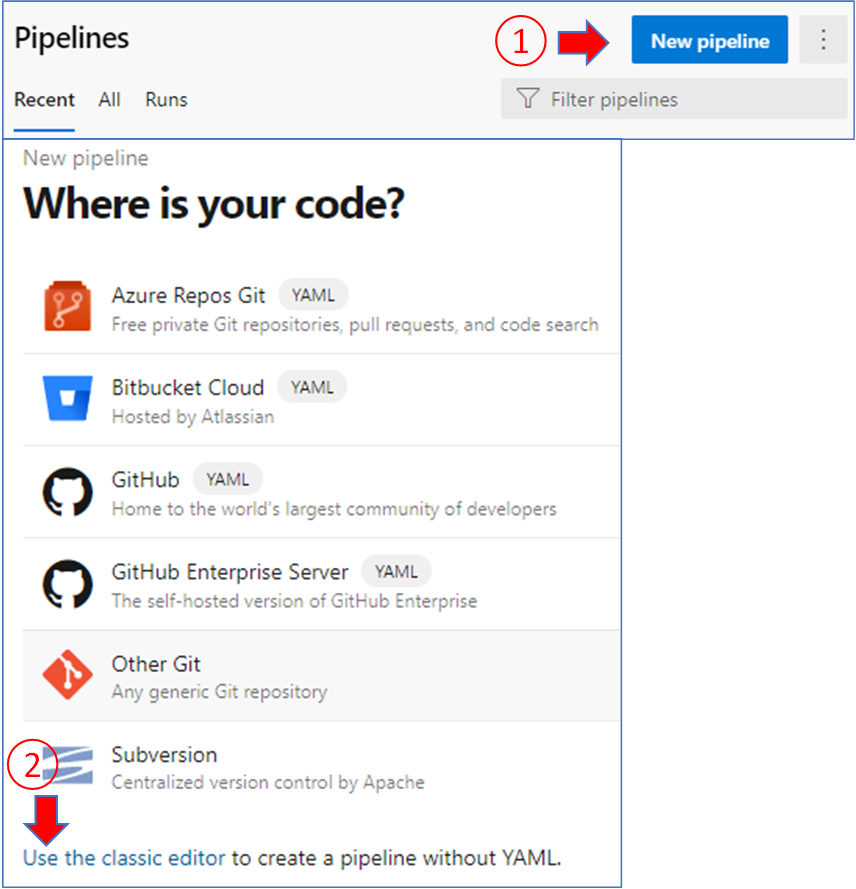
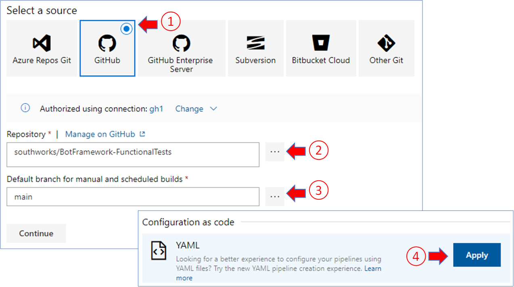
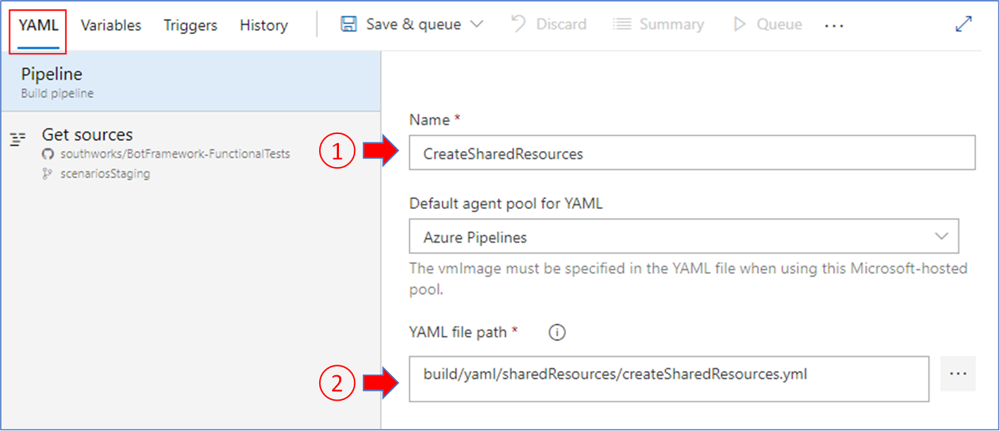
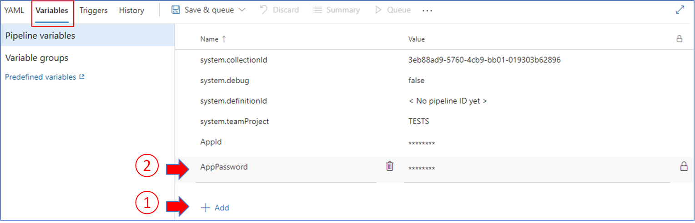
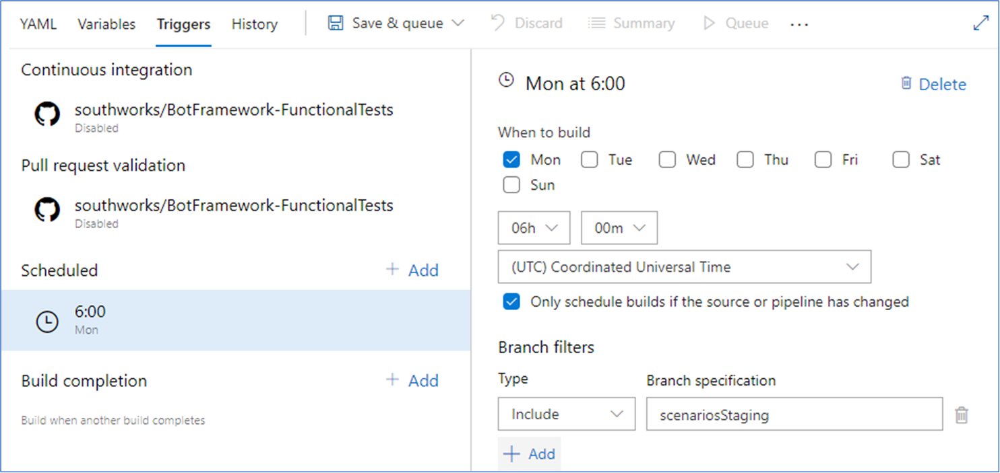
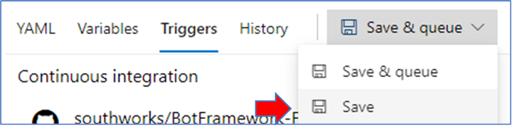

# How to setup Pipelines

The following steps will guide you through the creation of a pipeline from a YAML file.

## Requirements

- An [Azure DevOps Organization](https://docs.microsoft.com/en-us/azure/devops/organizations/accounts/create-organization?view=azure-devops).
- Access to the repository where the pipeline definition YAML file is stored.

## Steps

- Go to the pipeline section of your Azure DevOps organization and create a new pipeline using the classic editor.

  

- Configure the repository and branch. In the configuration as code section, click on Apply for the YAML file option.

  

- In the YAML tab, write the pipeline's name and select the YAML file you want to use.

  

- Go to the variables tab to add all the variables that will be used in the pipeline.

  

- In the triggers tab you can configure the triggers and schedules for each pipeline, all pipelines are configured to not trigger by default.

  

- When you are done configuring the pipeline, save the changes.

  
